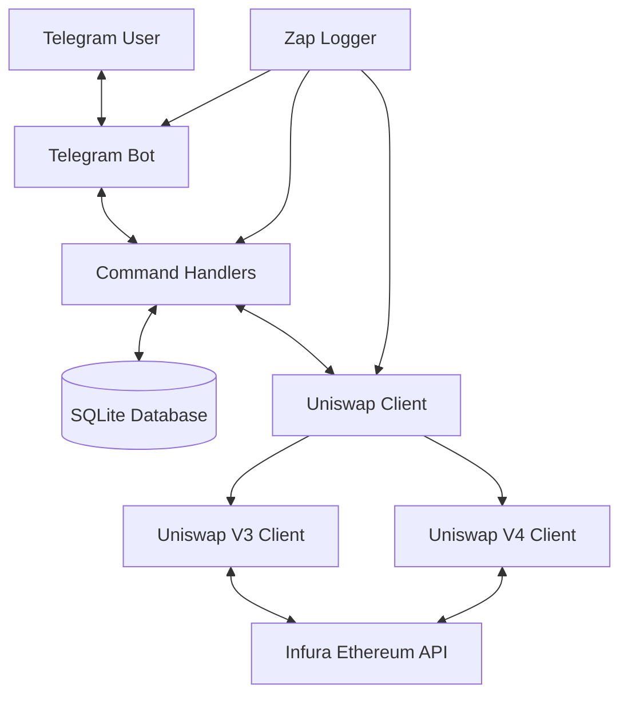

# Uniswap Position Fetcher Bot

A Telegram bot that tracks Uniswap positions (V3 and V4) for specified wallets and provides detailed status updates.

## Features

- Track multiple Ethereum wallets per user
- Fetch Uniswap V3 and V4 position data
- Display detailed position information including:
  - Token amounts
  - Price ranges
  - Unclaimed fees
  - Position creation time
- Secure and private - each user can only see their own wallets
- Comprehensive logging for debugging and monitoring
- Containerized for easy deployment

## Architecture

The application consists of several key components:



### Components

1. **Telegram Bot Interface**
   - Uses the gotgbot library to interact with Telegram API
   - Handles user commands and formats responses

2. **SQLite Database**
   - Stores user-wallet associations
   - Lightweight and embedded, requiring no external database server

3. **Uniswap Client**
   - Modular design with separate implementations for V3 and V4
   - Connects to Ethereum via Infura
   - Fetches position data from Uniswap contracts

4. **Logging System**
   - Uses Zap logger for structured, high-performance logging
   - Configurable log levels for different environments

### Data Flow

1. User adds wallet(s) via Telegram bot
2. Wallet addresses are validated and stored in SQLite database
3. On `/status` request, bot fetches current positions from Uniswap V3 and V4 contracts
4. Position data is processed and formatted into human-readable tables
5. Results are sent back to the user via Telegram

## Setup

### Prerequisites

- Docker (for containerized deployment)
- Telegram Bot Token (from [@BotFather](https://t.me/BotFather))
- Infura API Key (sign up at [infura.io](https://infura.io))

### Running with Docker

```bash
docker run -d \
  --name uniswap-fetcher \
  -e TELEGRAM_TOKEN=your_telegram_token \
  -e INFURA_API_KEY=your_infura_key \
  -e LOG_LEVEL=info \
  -v uniswap-data:/app/data \
  ghcr.io/korjavin/uniswapfetcher:latest
```

### Environment Variables

| Variable | Description | Default |
|----------|-------------|---------|
| `TELEGRAM_TOKEN` | Your Telegram bot token (required) | - |
| `INFURA_API_KEY` | Your Infura API key (required) | - |
| `LOG_LEVEL` | Logging level (debug, info, warn, error) | info |

### Building from Source

1. Clone the repository
   ```bash
   git clone https://github.com/korjavin/uniswapfetcher.git
   cd uniswapfetcher
   ```

2. Install dependencies
   ```bash
   go mod download
   ```

3. Build the application
   ```bash
   go build -o bot
   ```

4. Run locally
   ```bash
   export TELEGRAM_TOKEN=your_telegram_token
   export INFURA_API_KEY=your_infura_key
   ./bot
   ```

## Commands

| Command | Description |
|---------|-------------|
| `/start` | Initialize bot and show available commands |
| `/add_wallet <address>` | Add an Ethereum wallet address to track |
| `/remove_wallet <address>` | Remove a tracked wallet address |
| `/list_wallets` | Show all tracked wallet addresses |
| `/status` | Show detailed position information for all tracked wallets |

## Example Output

When using the `/status` command, you'll receive information like:

```
Found 2 Uniswap positions:

Wallet: 0x1234...5678
--------------------
1. USDC/WETH V3
   ID: 123456
   Created: 2023-02-15 14:30:45
   Amounts: 1000 USDC, 0.5 WETH
   Price Range: 1500 - 2500
   In Range: true
   Unclaimed Fees: 50 USDC, 0.025 WETH

2. USDC/WETH V4
   ID: 789012
   Created: 2023-03-01 09:15:30
   Amounts: 2000 USDC, 1.0 WETH
   Price Range: 1800 - 2200
   In Range: true
   Unclaimed Fees: 100 USDC, 0.05 WETH
```

## Development

### Project Structure

```
uniswapfetcher/
├── main.go           # Application entry point
├── handlers.go       # Telegram bot command handlers
├── db.go             # Database operations
├── uniswap/
│   ├── client.go     # Core Uniswap client interface
│   ├── v3.go         # Uniswap V3 implementation
│   ├── v4.go         # Uniswap V4 implementation
│   └── types.go      # Shared type definitions
├── Dockerfile        # Container definition
├── go.mod            # Go module definition
└── .github/
    └── workflows/
        └── docker.yml # CI/CD pipeline
```

### Contributing

1. Fork the repository
2. Create your feature branch (`git checkout -b feature/amazing-feature`)
3. Commit your changes (`git commit -m 'Add some amazing feature'`)
4. Push to the branch (`git push origin feature/amazing-feature`)
5. Open a Pull Request
